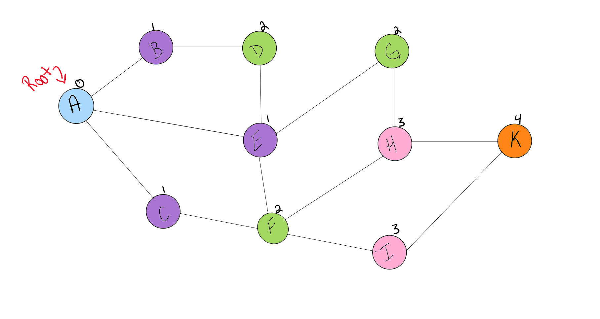

# Graph Traversal with Breadth-First Search (BFS)

## 1. Problem Domain

The problem involves implementing a graph data structure with nodes and edges, and performing a Breadth-First Search (BFS) traversal. The goal is to traverse the graph starting from a specified node and visit all reachable nodes in a breadth-first manner, returning the nodes in the order they are visited.

### Graph Structure
- **Node**: Represents a graph node with a value and a list of connected nodes (edges).
- **Edge**: Represents an undirected connection between two nodes.
- **Graph**: Manages nodes and edges, and provides methods for adding nodes, adding edges, and performing BFS traversal.

## 2. Algorithms

### Breadth-First Search (BFS)
BFS is an algorithm used to traverse or search through a graph. It explores all neighbors of a node before moving to the next level neighbors. BFS uses a queue to keep track of nodes to visit and ensures that nodes are visited level by level.

**Steps for BFS:**
1. **Initialization**:
   - Create a set `visited` to track visited nodes.
   - Create a queue and enqueue the starting node.
   - Create a list `result` to store the order of visited nodes.

2. **Traversal**:
   - While the queue is not empty:
     - Dequeue a node.
     - If the node has not been visited:
       - Mark it as visited.
       - Append the node's value to the `result` list.
       - Enqueue all unvisited neighbors of the node.

3. **Return**:
   - Return the `result` list containing the nodes in the order they were visited.

## 3. Pseudo Code

```pseudo
function BFS(graph, start_value):
    if start_value not in graph.nodes:
        return []

    start_node = graph.nodes[start_value]
    visited = set()
    queue = deque([start_node])
    result = []

    while queue is not empty:
        node = queue.dequeue()

        if node not in visited:
            visited.add(node)
            result.append(node.value)
            neighbors = sorted(node.edges, key=lambda n: n.value)
            for neighbor in neighbors:
                if neighbor not in visited:
                    queue.enqueue(neighbor)

    return result
```

## 4. Test Cases

### Test Case 1: Node Creation

- **Input**: Create a node with value "A".
- **Expected Output**: Node with value "A" and no edges.

### Test Case 2: Add Edge to Node

- **Input**: Add an edge between nodes "A" and "B".
- **Expected Output**: Node "A" has node "B" in its edges, and node "B" has node "A" in its edges.

### Test Case 3: Edge Creation

- **Input**: Create an edge between nodes "A" and "B".
- **Expected Output**: Edge is created, and nodes "A" and "B" have each other in their edge lists.

### Test Case 4: Graph Add Node

- **Input**: Add node "A" to the graph.
- **Expected Output**: Node "A" is present in the graph's node dictionary.

### Test Case 5: Graph Add Edge

- **Input**: Add an edge between nodes "A" and "B" in the graph.
- **Expected Output**: Nodes "A" and "B" are connected, and their edge lists reflect this connection.

### Test Case 6: Breadth-First Search with Non-existent Node

- **Input**: Perform BFS starting from a node "Z" that does not exist in the graph.
- **Expected Output**: Empty list [].

## 5. Big O Notation

### Time Complexity

- **Adding a Node**: \(O(1)\) – Insertion into the dictionary is constant time.
- **Adding an Edge**: \(O(1)\) – Insertion into the adjacency list is constant time.
- **Breadth-First Search (BFS)**:
  - **Time Complexity**: \(O(V + E)\)
    - **V**: Number of vertices (nodes).
    - **E**: Number of edges.
    - **Explanation**: Each node is enqueued and dequeued once, and each edge is examined at most twice.

### Space Complexity

- **Graph Storage**: \(O(V + E)\)
  - **Explanation**: The adjacency list stores all edges, and the node storage is proportional to the number of nodes.
- **BFS**: \(O(V)\)
  - **Explanation**: Space used by the queue and visited set is proportional to the number of vertices.

### Visualization

The visualization displays a graph where nodes and edges are illustrated. A BFS traversal starts from a highlighted node and explores all its neighbors before moving to the next level of neighbors. Nodes are colored or marked to show the order of traversal, helping to understand the BFS algorithm's level-by-level exploration.



This `whiteboard.md` file includes detailed explanations and pseudo code to help understand the BFS algorithm and its implementation. It also outlines the test cases and complexity analysis to ensure a thorough understanding of the graph traversal problem.
