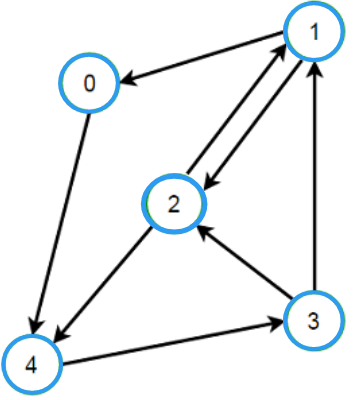

# Graph Strong Connectivity Challenge

## 1. Problem Domain

**Problem Statement**:
Given a directed graph, determine if it is strongly connected. A directed graph is said to be strongly connected if every vertex is reachable from every other vertex.

**Definitions**:
- **Directed Graph**: A graph where edges have a direction, going from one vertex to another.
- **Strongly Connected**: A graph where there is a path from any vertex to every other vertex, and vice versa.

## 2. Algorithms

To check if a graph is strongly connected, we use the following steps:

1. **Depth-First Search (DFS) from any vertex**:
   - Perform DFS starting from an arbitrary vertex and mark all reachable vertices.
   - If not all vertices are reachable, the graph is not strongly connected.

2. **Transpose the Graph**:
   - Create a new graph where all edges are reversed.

3. **Depth-First Search (DFS) on the Transposed Graph**:
   - Perform DFS starting from the same vertex in the transposed graph.
   - If all vertices are reachable in the transposed graph, then the graph is strongly connected.

## 3. Pseudo Code

```text
function isStronglyConnected(graph):
    visited = array of size V initialized to False
    
    # Step 1: Perform DFS from the first vertex
    dfs(graph, 0, visited)
    if any vertex is not visited:
        return False
    
    # Step 2: Transpose the graph
    transposed_graph = transpose(graph)
    
    # Step 3: Perform DFS on the transposed graph
    visited = array of size V initialized to False
    dfs(transposed_graph, 0, visited)
    if any vertex is not visited:
        return False
    
    return True

function dfs(graph, vertex, visited):
    visited[vertex] = True
    for each adjacent_vertex in graph[vertex]:
        if not visited[adjacent_vertex]:
            dfs(graph, adjacent_vertex, visited)

function transpose(graph):
    transposed_graph = new Graph(V)
    for each vertex in graph:
        for each adjacent_vertex in graph[vertex]:
            transposed_graph.addEdge(adjacent_vertex, vertex)
    return transposed_graph
```

## 4. Test Cases

Below are several test cases to validate the correctness of the `isStronglyConnected` method:

1. **Test Case 1: Not Strongly Connected**
   - **Input**: `numbers = [[1,2],[2,3],[3,4],[4,5],[5,6],[6,4],[1,7],[7,3]]`
   - **Description**: This graph contains multiple disconnected components. Vertex 1 can reach vertices 2 through 7, but vertices 0 and 7 are isolated from some vertices.
   - **Expected Output**: `Not strongly connected`

2. **Test Case 2: Strongly Connected**
   - **Input**: `numbers = [[1,2],[1,0],[0,4],[4,3],[3,2],[3,1],[2,1],[2,4]]`
   - **Description**: This graph forms a single cycle with an additional connection. Every vertex can reach every other vertex.
   - **Expected Output**: `Strongly connected`

3. **Test Case 4: Single Vertex**
   - **Input**: `numbers = []` (One vertex, no edges)
   - **Description**: A single vertex graph is trivially strongly connected as there are no other vertices to connect.
   - **Expected Output**: `Strongly connected`

4. **Test Case 5: Disconnected Graph**
   - **Input**: `numbers = [[0,1],[1,2],[3,4]]`
   - **Description**: This graph has two disconnected subgraphs. There is no path between the vertices of different subgraphs.
   - **Expected Output**: `Not strongly connected`

5. **Test Case 6: Simple Cycle**
   - **Input**: `numbers = [[0,1],[1,2],[2,0]]`
   - **Description**: This graph forms a simple cycle. Each vertex can reach every other vertex in the cycle.
   - **Expected Output**: `Strongly connected`

6. **Test Case 7: Two Cycles Connected**
   - **Input**: `numbers = [[0,1],[1,2],[2,0],[3,4],[4,5],[5,3],[0,3]]`
   - **Description**: This graph has two distinct cycles connected by a single edge. Not all vertices are interconnected through a single path.
   - **Expected Output**: `Not strongly connected`

## 5. Big O Notation

### Time Complexity

1. **Depth-First Search (DFS)**:
   - **Time Complexity**: O(V + E)
     - Where V is the number of vertices and E is the number of edges.
     - DFS visits each vertex once and traverses each edge once.

2. **Transposing the Graph**:
   - **Time Complexity**: O(V + E)
     - Transposing the graph involves iterating over all vertices and edges to reverse the direction of edges.

3. **Overall Time Complexity**:
   - The `isStronglyConnected` function performs DFS twice (once on the original graph and once on the transposed graph), and the graph transposition itself also takes O(V + E).
   - Therefore, the overall time complexity is O(V + E), as the time complexities of individual operations are additive and all are linear in terms of vertices and edges.

### Space Complexity

1. **DFS Stack Space**:
   - **Space Complexity**: O(V)
     - The DFS stack (or recursion stack) can grow to the size of the number of vertices in the worst case.

2. **Visited Array**:
   - **Space Complexity**: O(V)
     - A boolean array of size V is used to keep track of visited vertices.

3. **Graph Representation**:
   - **Space Complexity**: O(V + E)
     - The adjacency list representation uses space proportional to the number of vertices and edges.

4. **Overall Space Complexity**:
   - The overall space complexity is O(V + E), accounting for the graph representation and the DFS-related space requirements.

### Summary

- **Time Complexity**: O(V + E)
- **Space Complexity**: O(V + E)

## Visualization

<p align="center">
  
  
</p>

The algorithm efficiently checks for strong connectivity in a directed graph using depth-first search and graph transposition, with linear time and space complexity relative to the size of the graph.
