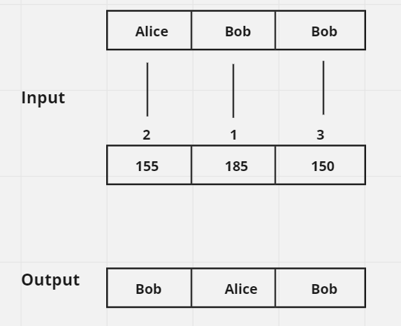

# Whiteboard for `sort_people` Function

## 1. Problem Domain

The task is to sort a list of people's names based on their heights in descending order. We are provided with two arrays: `names` and `heights`. The `names` array contains the names of the individuals, and the `heights` array contains their corresponding heights. The objective is to reorder the `names` array to reflect the descending order of the `heights` array.

## 2. Algorithms

The solution involves the following steps:

1. **Mapping Heights to Names**: Utilize a hash table (dictionary) to associate each height with the corresponding person's name.
2. **Sorting Heights**: Arrange the heights in descending order.
3. **Constructing the Output List**: Generate the output list of names by referencing the sorted heights and retrieving the associated names from the hash table.

## 3. Pseudo Code

```plaintext
function sort_people(names, heights):
    // Create a hash table to map heights to names
    height_to_name = {}
    for i from 0 to length(names) - 1:
        height_to_name[heights[i]] = names[i]
    
    // Sort the heights in descending order
    sorted_heights = sort(heights) in reverse order
    
    // Construct the output list of names using the sorted heights
    sorted_names = []
    for height in sorted_heights:
        sorted_names.append(height_to_name[height])
    
    return sorted_names
```

## 4. Test Cases

### Example Test Case

- **Input**: `names = ["Alice", "Bob", "Bob"]`, `heights = [155, 185, 150]`
- **Output**: `["Bob", "Alice", "Bob"]`

### Empty Input Test Case

- **Input**: `names = []`, `heights = []`
- **Output**: `[]`

### Single Person Test Case

- **Input**: `names = ["Alice"]`, `heights = [160]`
- **Output**: `["Alice"]`

### Same Height Test Case

- **Input**: `names = ["Alice", "Bob", "Charlie"]`, `heights = [160, 160, 160]`
- **Output**: `["Alice", "Bob", "Charlie"]`

### Descending Order Test Case

- **Input**: `names = ["Alice", "Bob", "Charlie"]`, `heights = [180, 170, 160]`
- **Output**: `["Alice", "Bob", "Charlie"]`

### Ascending Order Test Case

- **Input**: `names = ["Alice", "Bob", "Charlie"]`, `heights = [160, 170, 180]`
- **Output**: `["Charlie", "Bob", "Alice"]`

## 5. Big O Notation

### Time Complexity

- **Mapping Heights to Names**: O(n), where n is the number of people.
- **Sorting Heights**: O(n log n), assuming a comparison-based sorting algorithm is used.
- **Constructing the Output List**: O(n).
- **Overall Time Complexity**: O(n log n) due to the sorting step.

### Space Complexity

- **Hash Table**: O(n) for storing the mappings.
- **Sorted Heights**: O(n) for storing the sorted heights.
- **Sorted Names**: O(n) for storing the output list.
- **Overall Space Complexity**: O(n).

## 6. Visualization

