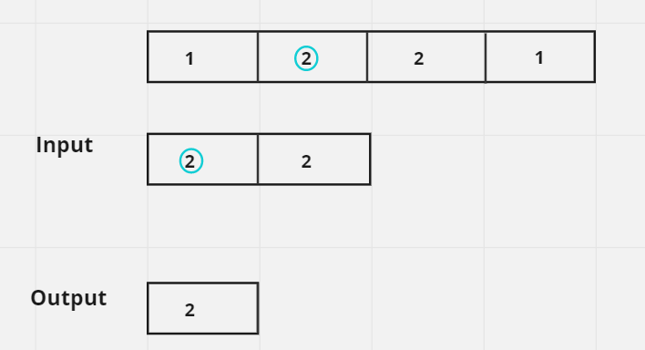

# Whiteboard.md

## Problem Domain

The problem involves finding the intersection of two arrays of integers. The intersection should consist of only unique elements that are present in both arrays. The result can be returned in any order. This is a common problem in computer science, often associated with tasks such as set operations, data filtering, and collection management.

**Input:**

- Two arrays of integers, `arr1` and `arr2`.

**Output:**

- An array containing the unique intersection of elements present in both `arr1` and `arr2`.

**Example:**

```plaintext
Input:
arr1 = [1, 2, 2, 1]
arr2 = [2, 2]

Output:
[2]
```

### Constraints

- Each element in the result must be unique.
- The result can be returned in any order.
- Both input arrays can contain duplicate elements.
- Array lengths can vary, with the possibility of one or both arrays being empty.
- Elements can be positive, negative, or zero.

## Algorithms

To solve this problem, we will use a combination of hash tables and linked lists.

### Algorithm Steps

1. **Hash Table Construction:**
   - Traverse the first array (`arr1`) and store each element in a hash table. This allows quick lookup to check if an element exists in `arr1`.

2. **Intersection Calculation:**
   - Traverse the second array (`arr2`).
   - For each element in `arr2`, check if it exists in the hash table and hasn't already been added to the linked list (to ensure uniqueness).
   - If both conditions are satisfied, add the element to the linked list.

3. **Result Conversion:**
   - Convert the linked list into a regular Python list to return the result.

The use of a hash table enables efficient checking of element existence, and the linked list ensures that each intersecting element is added only once.

## Pseudo Code

```plaintext
class ListNode:
    constructor(value, next=null):
        self.value = value
        self.next = next

class LinkedList:
    constructor():
        self.head = null

    method add(value):
        if contains(value):
            return

        new_node = ListNode(value)
        if self.head is null:
            self.head = new_node
        else:
            current = self.head
            while current.next is not null:
                current = current.next
            current.next = new_node

    method contains(value):
        current = self.head
        while current is not null:
            if current.value == value:
                return true
            current = current.next
        return false

    method to_list():
        result = []
        current = self.head
        while current is not null:
            result.append(current.value)
            current = current.next
        return result

function array_intersection(arr1, arr2):
    hash_table = {}
    for num in arr1:
        hash_table[num] = true

    intersection_list = LinkedList()

    for num in arr2:
        if num in hash_table:
            intersection_list.add(num)

    return intersection_list.to_list()
```

## Test Cases

Here are some test cases that we can use to verify the correctness of our solution:

1. **Basic Intersection:**
   - **Input:** `arr1 = [1, 2, 2, 1], arr2 = [2, 2]`
   - **Output:** `[2]`
   - **Explanation:** Both arrays contain the number `2`, so the intersection is `[2]`.

2. **No Intersection:**
   - **Input:** `arr1 = [1, 2, 3], arr2 = [4, 5, 6]`
   - **Output:** `[]`
   - **Explanation:** There are no common elements, resulting in an empty intersection.

3. **Empty Arrays:**
   - **Input:** `arr1 = [], arr2 = []`
   - **Output:** `[]`
   - **Explanation:** Both arrays are empty, so the intersection is also empty.

4. **One Empty Array:**
   - **Input:** `arr1 = [1, 2, 3], arr2 = []`
   - **Output:** `[]`
   - **Explanation:** One array is empty, resulting in no intersection.

5. **Intersection with Duplicates:**
   - **Input:** `arr1 = [4, 5, 9, 4], arr2 = [9, 4, 9, 8, 4]`
   - **Output:** `[4, 9]`
   - **Explanation:** Both arrays contain `4` and `9`, so the intersection is `[4, 9]`.

6. **All Elements Intersect:**
   - **Input:** `arr1 = [7, 8, 9], arr2 = [9, 7, 8]`
   - **Output:** `[7, 8, 9]`
   - **Explanation:** All elements intersect, hence the result is `[7, 8, 9]`.

7. **Large Numbers:**
   - **Input:** `arr1 = [100000, 200000, 300000], arr2 = [300000, 400000, 500000]`
   - **Output:** `[300000]`
   - **Explanation:** `300000` is the only common element between the two arrays.

8. **Negative Numbers:**
   - **Input:** `arr1 = [-1, -2, -3, 4], arr2 = [-3, 4, 5]`
   - **Output:** `[-3, 4]`
   - **Explanation:** `-3` and `4` are the common elements.

9. **Same Numbers Repeated:**
   - **Input:** `arr1 = [0, 0, 0, 0], arr2 = [0, 0, 0]`
   - **Output:** `[0]`
   - **Explanation:** Both arrays only have `0`, so the intersection is `[0]`.

10. **Large Input:**
    - **Input:** `arr1 = list(range(1000)), arr2 = list(range(500, 1500))`
    - **Output:** `[500, 501, ..., 999]`
    - **Explanation:** The intersection is the range `[500, 999]`.

## Big O Notation

The time and space complexity of the solution can be analyzed as follows:

### Time Complexity

1. **Building the Hash Table:** `O(n)` where `n` is the length of `arr1`.
   - We iterate over `arr1` once to populate the hash table.

2. **Finding the Intersection:** `O(m)` where `m` is the length of `arr2`.
   - We iterate over `arr2` to check for each element in the hash table.

3. **Linked List Operations:** Each insertion and search operation in the linked list takes `O(1)` on average, as we are only adding unique elements.

The overall time complexity is `O(n + m)`, where `n` is the length of `arr1` and `m` is the length of `arr2`.

### Space Complexity

1. **Hash Table Storage:** `O(n)` for storing elements from `arr1`.
2. **Linked List Storage:** `O(min(n, m))` for storing the intersection elements, assuming all elements intersect.

### Visualization



The overall space complexity is `O(n + min(n, m))`, accounting for the hash table and linked list.

This makes the solution efficient for large input sizes, as both time and space complexity are linear concerning the size of the input arrays.
